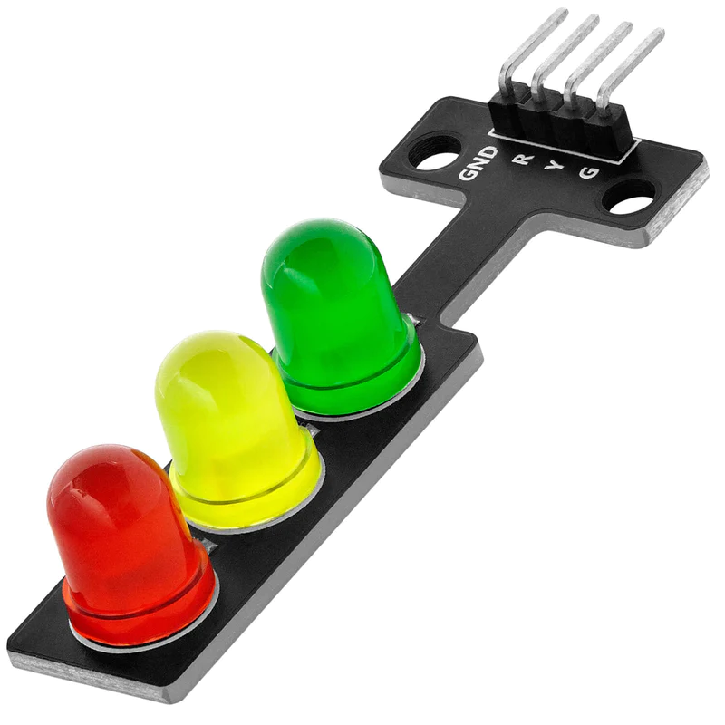
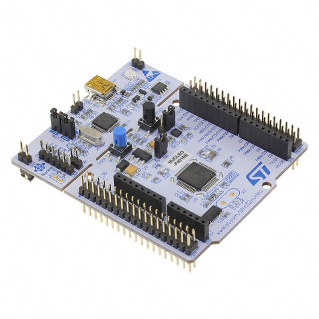
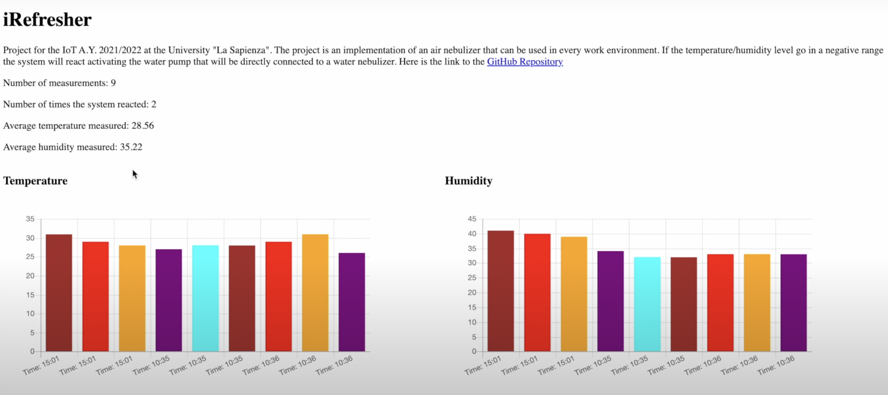
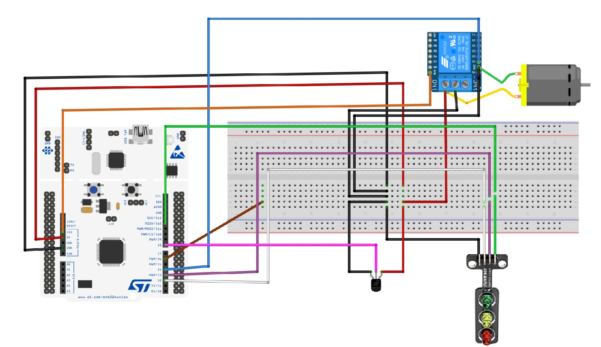
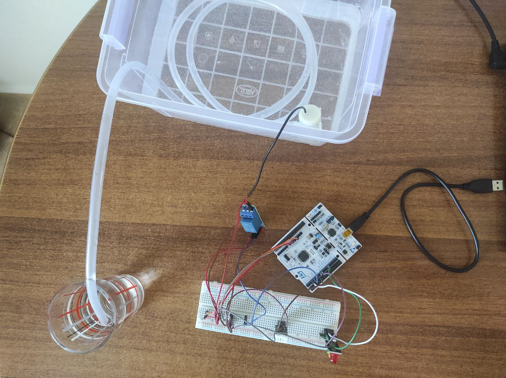
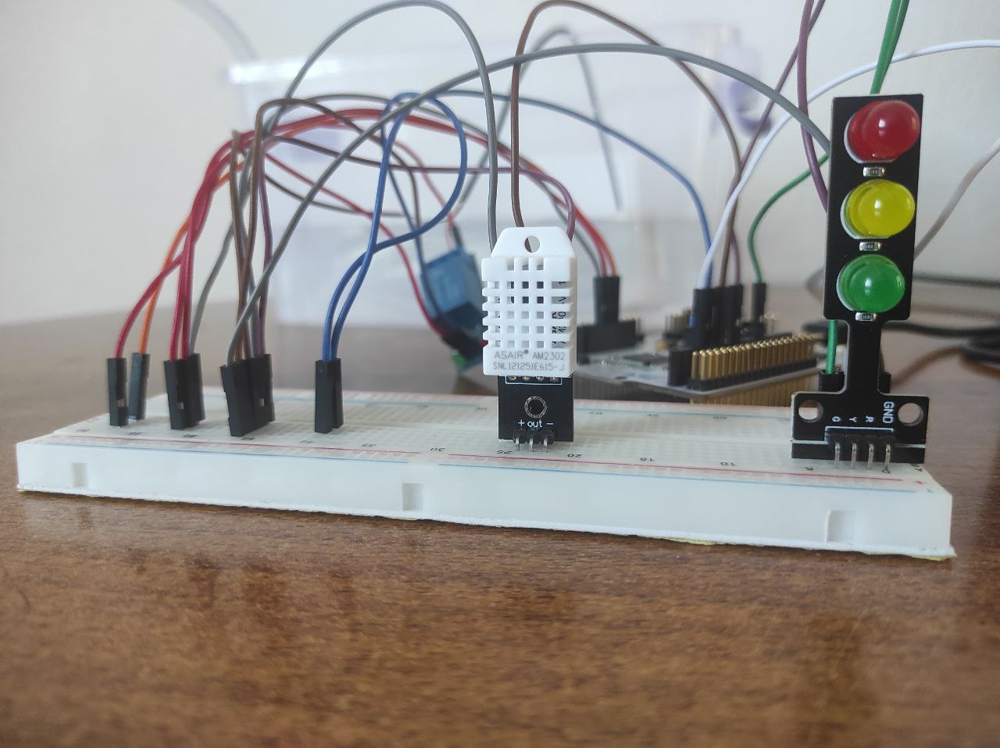

# iRefresher
<a href="https://github.com/carugno/IoT-Individual2022.git">This</a> is the repository for the Internet of Thing 2021/2022 of the Master in Computer Science, La Sapienza Università di Roma.

# General Description
This system is projected to help keeping the work environment always fresh by giving nebulized water through the air. By monitoring the environment, it’s possible to seek the conditions in which user is working. In particular, the system measures room temperature and humidity. By knowing that, the system can decide to activate or not the relay connected to the water pump and spread the nebulized water. We are assuming that, of course, the water pump is connected to a water nebulizer that we don't have.

## Sensors
So to take the measurements needed by the system the following two sensors were selected:
## DHT22 temperature and humidity sensor
DHT22 temperature and humidity sensor is used to measure air temperature and humidity.

    • Model DHT22 
    • Power supply 3.3-6V DC 
    • Output signal digital signal via single-bus 
    • Sensing element Polymer capacitor 
    • Operating range: humidity 0-100%RH / temperature -40~80 Celsius 
    • Accuracy humidity +-2%RH(Max +-5%RH); / temperature <+-0.5 Celsius
    • Resolution : humidity 0.1%RH / temperature 0.1 Celsius 
    • Repeatability humidity +-1%RH / temperature +-0.2 Celsius 
    • Sensing period Average: 2s 
    • Dimensions small size 14*18*5.5mm; big size 22*28*5mm 

The sensing done by the sensor is periodic because the system needs to continuously evaluate the environment in which the person is working. In particular the interval at which the sensors take their measurements is 15 seconds so that the system will not be updated with too many similar values. 

## Actuators
To act on the environment the following two actuators were selected:
## 1 Channel relay module
A channel relay module is used to trigger the water pump.
 

    • Supply Voltage	3.75 to 6 V
    • Supply Current	70 mA
    • Input Control Signal	Active Low
    • Input Control Signal Current	1.5 to 1.9 mA
    • Relay Max Contact Voltage	250 VAC or 30 VDC
    • Relay Max Contact Current	10 A
    • Dimensions
        Length	43 mm (1.69")
        Width	17.5 mm (0.69")
        Height	17 mm (0.67")
        Weight	13 g (0.459 oz)

## Water pump
The water pump is activated according to the values provided by sensors. Triggered by relay module, the water pump will take the water needed to be nebulized. From the measurements done, we see that it irrigates from 20-25 ml/second. 

    • Operating Voltage: 3-5 V
    • Operating Current: 100 - 200 mA
    • Water Inlet Entrance Dimension: 5.0 mm
    • Water Outlet Exit Outer Diameter: 7.5 mm
    • Water Outlet Exit Inner Diameter: 4.5 mm
    • Head Distance: 0.3 - 0.8 meter
    • Flow Rate: 1.2 - 1.6 Liter per minute
    • Weight: 28g   

## Traffic Light
 It has three LEDs: red, yellow, and green. They are used to provide feedback on the usage of the water pump. The red led is turned on when the pump's work is done correctly; the yellow one is turned on when the the pump is actived and running; the green one is turned on when the pump is in idle.

 

The activation or deactivation of these actuators will be done automatically by the system.

# System Architecture
In the following section the architecture of the whole system will be described starting from an overall view of the network components, then analyzing all the cloud aspects, and in conclusion there will be a brief description of how the sensors and actuators are connected to the board.
The architecture of the network can be seen as a chain of blocks that exchange messages; this structure is shown in the image above. More in detail the block that compose the system are:
1. ***NUCLEO-F401RE Board***: it generates and sends data to the broker that is in the next block of the chain using mqtt-sn, it publishes the messages on the topic “out”. 

 

2. ***MOSQUITTO***:  it is a MQTT-SN/MQTT message broker that is the closest block to the board. Indeed, it interacts directly with it. In particular it stores the messages coming from the board in the topic “out” .

 

3. ***MQTT-SN/MQTT TRANSPARENT BRIDGE***: it is a python script that works as a bridge exchanging messages using MQTT between the broker in the previous block and the broker on the cloud in the next block of the chain.    It is subscribed to the topic “out” of the previous block broker. When a message is published on the topic of the previous block, the bridge reads this new publication and publishes it into the cloud broker.

   

4. ***Amazon Web Services***: is the cloud part of the system. All the data received from the previous block on the topic “temperature” is processed, stored and then made available to the user using API REST.

  

5. ***Web Application***:   last block of the chain. Allows the user to visualize the data collected by the system. In particular using charts the user can see not only the measurements of the last hour but also see them almost in real time (we need to take into account the latency needed by the data to go from the board to the cloud services).

   

### Cloud Services

As already mentioned the cloud service provider used is Amazon Web Services. In particular the services used are:
- ***Iot Core***:   whose main role is to work as a mqtt broker where messages are published. Moreover, the rule engine of the service allowed us to directly act on the incoming messages, saving them on the DB and invoking functions when a new message arrives.
- ***DynamoDB***:   database where every data received from the board is stored. In particular it has 2 tables to store the information received and 1 used to keep track of the connections to the websocket service.
- ***Lambda***:   that allows us to write the functions for several purposes like: interact with the database, handle the websocket (connection, disconnection and new information on the status). In particular it has 1 function to read the data of the sensors.
- ***API Gateway***:   to create and publish both the REST API and the WebSocket API
- ***AWS Amplify***:   to provide the web application’s static content to the user 

### System photos
  
  
  

# Linkedin:
Here is my <a href="https://www.linkedin.com/in/carlo-carugno-b50331142/">Linkedin Account</a>
# YouTube Video:

Here is the link to the  <a href="https://youtu.be/c9EnjmBPhZo">YouTube Demo</a>

                                                                                 